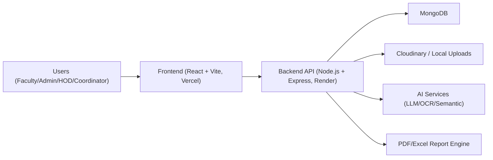

# System Architecture - FRMS

## High-Level Architecture

## Key Components
- Frontend:
  - Public pages: landing, register, login, pending approval.
  - Protected app: dashboard, modules, approvals, reports, AI suite, user management.
  - API base via `import.meta.env.VITE_API_URL` with Render fallback.
- Backend:
  - Auth + RBAC middlewares.
  - Domain controllers for records, approvals, reports, AI, users.
  - Audit and notification services.
  - Storage abstraction for Cloudinary/local file URLs.
- Data:
  - MongoDB collections for users, research records, reports, lookups, audit logs, notifications.

## Security
- JWT-based auth.
- Role-based access control at route level.
- Register endpoint protects against role self-assignment.
- Audit trail for approvals, role changes, and exports.
