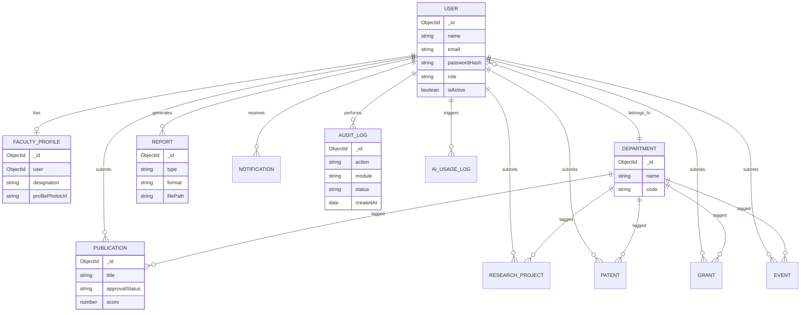

# ER Diagram - FRMS

```mermaid
erDiagram
  USER ||--o| FACULTY_PROFILE : has
  USER }o--|| DEPARTMENT : belongs_to
  USER ||--o{ PUBLICATION : submits
  USER ||--o{ RESEARCH_PROJECT : submits
  USER ||--o{ PATENT : submits
  USER ||--o{ GRANT : submits
  USER ||--o{ EVENT : submits
  USER ||--o{ REPORT : generates
  USER ||--o{ NOTIFICATION : receives
  USER ||--o{ AUDIT_LOG : performs
  USER ||--o{ AI_USAGE_LOG : triggers

  DEPARTMENT ||--o{ PUBLICATION : tagged
  DEPARTMENT ||--o{ RESEARCH_PROJECT : tagged
  DEPARTMENT ||--o{ PATENT : tagged
  DEPARTMENT ||--o{ GRANT : tagged
  DEPARTMENT ||--o{ EVENT : tagged

  USER {
    ObjectId _id
    string name
    string email
    string passwordHash
    string role
    boolean isActive
  }
  FACULTY_PROFILE {
    ObjectId _id
    ObjectId user
    string designation
    string profilePhotoUrl
  }
  DEPARTMENT {
    ObjectId _id
    string name
    string code
  }
  PUBLICATION {
    ObjectId _id
    string title
    string approvalStatus
    number score
  }
  REPORT {
    ObjectId _id
    string type
    string format
    string filePath
  }
  AUDIT_LOG {
    ObjectId _id
    string action
    string module
    string status
    date createdAt
  }
```
