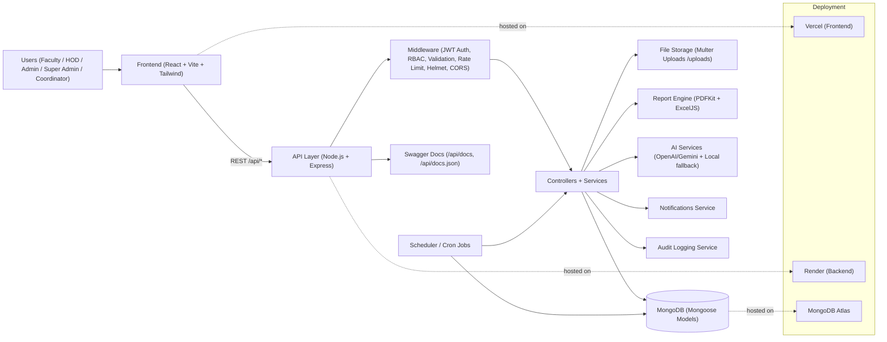

# System Architecture Diagram - FRMS

## High-Level Flow

1. User interacts with React frontend.
2. Frontend calls backend REST APIs.
3. Backend middleware validates token and role.
4. Controllers process requests and update MongoDB.
5. Optional modules generate reports, AI insights, notifications, and audit logs.
6. Scheduler performs periodic analytics and reminder jobs.

